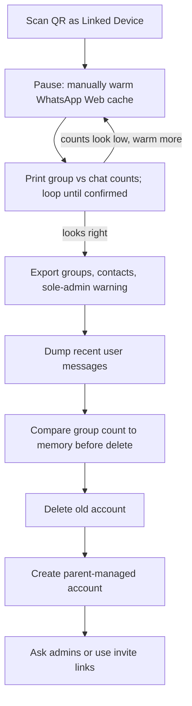

# WhatsApp readable backup for account transition

## What we can and cannot promise

Deleting the current account **removes him from every group**. **Do not rely on WhatsApp’s own backups** (Google Drive or otherwise) being available or restorable after deletion — we have not verified that, and the exporter does not depend on it. The new parent-managed account should be treated as starting empty. Groups only come back if an admin re-adds him or he uses an invite link.

On Android **without root**, the on-phone `msgstore.db.crypt15` file is not usable (the key lives in app-private storage). This tool therefore uses a **linked WhatsApp Web session** (`whatsapp-web.js`):

- **Reliable enough for the must-have:** group list, admin names/numbers, invite links, “is he already an admin?”
- **Best-effort for chat text:** about **50** recent *user* messages (text/media placeholders) per chat, not counting system noise. Media will be noted as `[MEDIA: image]` rather than downloaded.

Run this **while the old account still exists**, with the phone in hand.



## Warming the WhatsApp Web cache (manual)

WhatsApp Web **lazy-loads**. `getChats()` and `fetchMessages()` only see conversations and messages already in that Chrome session’s store. Opening chats in the **visible** Puppeteer window (or scrolling the list) is the practical way to pull more into cache. Recent user messages usually appear just by **opening** the chat; scrolling up loads older ones.

After `ready`, the script will print a checklist and **wait for Enter** before Phase 1. Do this in the Chrome window it opened (not a separate browser):

What actually helps:

- **Keep the phone unlocked, on Wi‑Fi, and WhatsApp in the foreground** for the first few minutes so the linked session can finish syncing.
- **Scroll the left chat list all the way down**, slowly, then again. Inactive and older threads are not in the store until they have been listed.
- **Open Archived** (and scroll that list). Archived groups are easy to miss and are the ones most likely to be absent from `getChats()`.
- **Open Communities** and click into each community / subgroup so those groups are instantiated.
- **Search** for any group he remembers that still does not appear (`school`, `football`, a friend’s name). Opening a search result loads it.
- **Click into each group he wants to rejoin** (even briefly). This is the important one for **admins**, not just messages: participant lists are often empty until the group has been opened. Pinning those groups on the phone first makes this faster.
- **Only if a specific chat matters more:** open it and **scroll up** a few times. Skip this for a blanket dump.

What does not help much:

- Leaving the window idle without scrolling or opening chats
- Using a second WhatsApp Web tab (that is a different store; the script will not see it)
- Trying to “download all history” — Web has no such control

Optional script assist (small, after first Enter): programmatically scroll the chat list a few times, then `getChats()`.

**Hydration sanity check (before Phase 1):** print `N chats, M groups` (channels listed separately). Prompt: Enter = start export, or type `more` = go open more chats in Chrome, then Enter to re-scroll + `getChats()` + reprint counts **without** restarting (session stays via `LocalAuth`). Repeat until the count looks right. That is the last chance to avoid spending throttle budget on a cold session.

## Output layout

```
export/
  groups.csv              # spreadsheet: who to contact
  groups.md               # readable rejoin playbook
  contacts.csv            # display name, push name, phone (for “which John?” later)
  chat_summary.csv         # audit: name, type, last activity, exported count, participants loaded, errors
  chats/
    GROUP_<name>_<id>.txt
    DIRECT_<name>_<id>.txt
  progress.json           # Phase 2 only: which chat files are done
```

[`groups.csv`](export/groups.csv) / [`groups.md`](export/groups.md) per group:

- Group name, description, creation date if `GroupChat.createdAt` is present (descriptions often hold school/club rejoin notes)
- Member count, **participants loaded?** (empty list is a failure for the rejoin goal)
- Whether **he** is admin / sole admin
- Each admin: display name, push name, phone number if resolvable
- Invite link when `getInviteCode()` succeeds
- Last activity timestamp

**Zero-participant groups are a first-class failure**, not a quiet log line. If `participants.length === 0`: flag the CSV column; put a **Participants not loaded** banner at the top of `groups.md` listing those groups; print the same list loudly in the console (`Open this group in WhatsApp Web and rerun`). A group with no participants means we failed to capture the admins we are trying to preserve.

[`chat_summary.csv`](export/chat_summary.csv): one row per chat/group — name, type (group/direct/channel), last activity (UTC), exported message count, participants loaded (yes/no/n/a), error text. Seed from an existing file on resume (like contacts) and rewrite after each item so you can answer “did we export 37 or 237?” without opening text files. Phase 1 rewrites group rows; Phase 2 updates message counts.

Phone numbers may come back as WhatsApp **LID** ids (`@lid`) instead of `+44…`. Resolve with `client.getContactLidAndPhone()` and `getContactById()` (`name`, `pushname`, `number`). **Memoize by contact id** in a `Map` so the same admin in 10 groups is one lookup, not ten (keeps the throttle budget honest). On startup, **seed that Map from existing `contacts.csv`** if present (so a Phase 2 resume does not drop DM names when Phase 1 rewrites the group roster). After every new resolution, **rewrite** [`contacts.csv`](export/contacts.csv) from the full Map (display name, push name, phone). If a number cannot be resolved, keep the display name.

Invite links are a **bonus**, not the plan: `getInviteCode()` usually works only if he is already an admin (or the group allows it). Many groups will have a blank link; those need a human ask. Links that do get saved typically still work after he leaves, unless an admin resets them.

Also skip or label **channels/newsletters** (not rejoinable groups). Call `getChats()` **only after** Enter, so the warmed list is what we export.

`groups.md` should include a copy-paste “please add me back” message and a count of groups at the top, so they can check it against what he remembers before deleting anything.

## Implementation

New Node project in the repo root (the Gemini sketch in [`instructions_from_gemini.txt`](instructions_from_gemini.txt) is the starting idea; it will not be used as-is).

- [`package.json`](package.json) — pin `whatsapp-web.js` and `qrcode-terminal` with exact versions (`"1.34.x"` not `^`).
- [`package-lock.json`](package-lock.json) — **commit it**. Reinstall with `npm ci` so a re-run days later is the same tree. Do not `npm update` between runs; the library often breaks silently when WhatsApp Web internals rename fields.
- [`export.js`](export.js) — single script, two phases, **groups first**.
- [`.gitignore`](.gitignore) — also ignore `export/`, `.wwebjs_auth/`, `.wwebjs_cache/` so chats and the linked-device session never get committed. Do **not** ignore the lockfile.

Client setup (more robust than the Gemini script):

- `LocalAuth` so a crash does not require a new QR
- `headless: false` so they can click around in the same window the script uses
- handlers for `qr`, `ready`, `auth_failure`, `disconnected`
- after `ready`: print the cache-warming checklist, wait for Enter, then loop: scroll chat list → `getChats()` → print counts → confirm or warm more
- per-group / per-chat `try/catch`

**Filenames:** never use raw `chat.name`. Strip path-illegal characters (`/ \ : * ? " < > |`), control chars, trailing dots/spaces; cap the name at ~50 chars; **always** append `chat.id.user` so uniqueness does not depend on the name. Do not strip all non-ASCII (that turns every emoji group into `_____`); readability plus a stable id is enough.

**CSV:** RFC 4180 — quote every field, double internal quotes, keep newlines inside quotes. No raw `` `${name},${desc}` ``. A small helper is enough; no extra library required.

**`fetchMessages` hang:** wrap in `Promise.race` with a **20s** timeout (10s is tight on a slow first sync). On timeout, use whatever is already in the chat’s in-memory `messages` (or `[]`) and log the timeout in `chat_summary.csv`. Do not let one hung chat kill Phase 2.

**Community announcement / parent groups:** `participants` may be empty or admin-only even when fully loaded (`isAnnouncement`, `isParentGroup`, or similar). Do **not** put those on the “open and rerun” zero-participant list. Label them in `groups.md` as community announcement (member list restricted). True empty lists on ordinary groups still get the loud warning.

**Timestamps:** `m.timestamp` is usually seconds, sometimes ms. `const epoch = m.timestamp > 1e11 ? m.timestamp : m.timestamp * 1000` then `toISOString()` (UTC).

**Contact fallbacks:** `getContactLidAndPhone()` can return null. Phone field: resolved number, else empty string — never the literal `undefined`. Display name: `pushname || name || id.user`.

**Phase 1 — groups (do not skip, not resume-appended):** Each run **rewrites** `groups.csv` and `groups.md` from scratch (truncate then write the full current snapshot). Phase 1 is cheap; appending across a crash would duplicate rows and make the pre-delete count untrustworthy. Flush after each group so a mid-pass crash still leaves a partial file, but the **next** run starts the roster clean and picks up newly opened groups. `progress.json` is **not** used here.

Keep real groups (not channels). For each group read `participants` (`isAdmin` / `isSuperAdmin`), resolve contacts via the memoized map, include `createdAt` when present. Call `getInviteCode()` only if he is admin; log **`invite skipped (not admin)`** vs **`invite failed: <error>`**. At the end of Phase 1, print two loud console blocks: (1) **zero-participant groups** to open and rerun (excluding announcement/parent groups), (2) `You are sole admin in: X, Y, Z — appoint another admin in the phone app before deleting` (or “none”). If phase 2 later fails, the rejoin list still exists.

**Phase 2 — readable chats:** `fetchMessages` with a **higher raw limit** (about 150) and a **20s timeout**. **Sort by parsed `timestamp` ascending**. Drop system/notification types (`notification`, `gp2`, `protocol`, e2e notices, etc.). Then `slice(-50)` so the kept lines are the most **recent** user messages (text, plus media as `[MEDIA: type]`). If fewer than 20 survive, log that the chat was notification-heavy, timed out, or not fully loaded. Skip chats already in `progress.json` (Phase 2 only). Resolve senders into the same contact Map and **rewrite `contacts.csv` after each chat**. Update `chat_summary.csv` after each chat. Direct-chat filenames remain a backup identity hint.

## Throttling (keep it light)

WhatsApp bans unofficial clients mainly for **sending** (spam, cold outreach, identical bursts). This tool is a **one-shot read** of his own chats: no messages sent, nobody added, no media downloaded. An account ban is unlikely. The realistic failure is the **linked session dropping** if we hammer `getInviteCode` / contact lookups / message loads with zero pause.

Do **not** use 20–90s “anti-spam bot” gaps — that turns 80 groups into hours and is more likely to look like a long-lived automation. Modest pacing is enough:

- One group/chat at a time (no `Promise.all` over the full list)
- Phase 1: ~1.5–3s random delay **between groups**
- Call `getInviteCode()` only if he is already an admin (that call hits the server; it usually fails for everyone else anyway)
- Contact lookups go through the memoized map (repeat admins are free after the first hit)
- Phase 2: ~1–2s random delay between chats
- On `disconnected` / `auth_failure`: **stop**, do not reconnect in a loop. Re-run later; Phase 1 rewrites the roster, Phase 2 skips finished chats via `progress.json`
- Never `client.sendMessage` or mutate groups

README: if the Chrome window logs out mid-run, wait a few minutes, scan again if needed, and re-run. Do not delete the account until `groups.md` looks complete.

[`README.md`](README.md) must be the runbook, not a stub. Include:

- Requirements: Node 18+, Google Chrome, phone in hand, do this **before** deleting the account
- Install with **`npm ci`** (uses the committed lockfile), then `node export.js`
- Limits: groups/admins are the reliable part; chat text is ~50 recent user messages; timestamps are **UTC** (`…Z`); do not rely on WhatsApp/Google Drive backups after deletion
- **Cache-warming checklist** (same steps the terminal prints while waiting for Enter): phone unlocked on Wi‑Fi; scroll chat list twice; open Archived; open Communities; search missing groups; click into groups he cares about; scroll up only for chats that matter more; do it in the script’s Chrome window
- After the count prompt: if the group number looks low, type `more`, open more groups in the same Chrome window, then confirm again (no restart, no new QR)
- After export, **this order**:
  1. Review `groups.md`, `groups.csv`, and `chat_summary.csv`. Open any ordinary group still marked participants-not-loaded, then rerun
  2. In the Android app, **transfer sole admin** on every group the script listed
  3. Optional: official WhatsApp **Export chat** (email/zip) for a few important personal chats the script only has ~50 lines of
  4. **Unlink** this session: Settings → Linked devices → log out
  5. **Delete** the old account (Settings → Account → Delete account)
  6. Create the parent-managed account (same number still leaves every group). Rejoin via invite links and admin numbers in `groups.csv`
- Do not copy `export/` or `.wwebjs_auth/` into git, email, or cloud sync if you can avoid it (private messages)
- Troubleshooting: if `ready` never fires or login hangs, try system Chrome (`/Applications/Google Chrome.app/Contents/MacOS/Google Chrome`); do not `npm update` mid-run

## Out of scope

- Decrypting the Android local/Google Drive backup (needs root or a saved 64-digit E2E backup key)
- Downloading photos, videos, stickers, or voice notes (text + `[MEDIA: type]` is enough)
- Rejoining groups automatically (the new account does not exist yet; adding people via an unofficial client is also a ban risk)

If a fuller message archive is needed later and they already have WhatsApp’s **64-digit end-to-end backup key**, that can be a separate decrypt-and-export pass. It does not replace the group/admin list.
