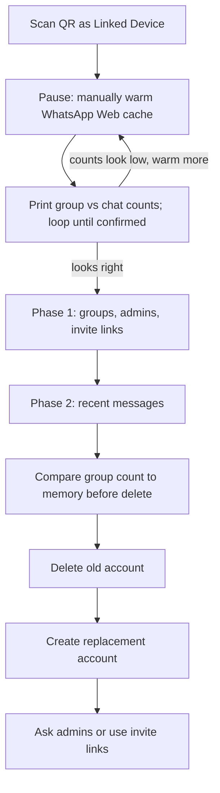

# WhatsApp readable backup for account transition

## Project context

A WhatsApp account is being deleted and replaced with a new account on the same phone number. Deleting the account **removes that person from every group**, and the new account starts empty — same number or not. Groups only come back if an existing admin re-adds them, or they use an invite link.

One reason to do that is WhatsApp’s **parent-managed accounts** feature: a standard account cannot be converted in place, so the old account is deleted and a new parent-managed one is created on the same number. The group list still has to be rebuilt by hand.

So the point of this tool is **not** a perfect message archive. It is to capture, before deletion, the information needed to **get back into those groups afterwards**: group names, who the admins are, their phone numbers, and any invite links. Chat text is a secondary nice-to-have.

Two hard constraints shape every decision below:

1. **The work is irreversible.** Once the account is deleted, anything not captured is gone. A silent failure in this tool is worse than a crash, so failures are surfaced loudly rather than logged quietly.
2. **On Android without root, the on-phone `msgstore.db.crypt15` file is not usable** — the decryption key lives in app-private storage. So this tool uses a **linked WhatsApp Web session** via `whatsapp-web.js`, which sees only what that browser session has loaded.

**Do not rely on WhatsApp's own backups** (Google Drive or otherwise) being available or restorable after deletion — that has not been verified, and this tool does not depend on it.

What the linked session can deliver:

- **Reliable:** group list, admin names and numbers, invite links, "is the owner an admin?"
- **Best-effort:** about **50** recent user messages per chat. Media is recorded as `[MEDIA: image] <caption>` rather than downloaded — keep the caption, it is often the actual content.

Run this **while the old account still exists**, with the phone in hand.

`instructions_from_gemini.txt` in this repo is the original throwaway sketch of the idea. It is **superseded by this document** and kept only for provenance — do not implement from it. Several things in it are actively wrong for this job (`headless: true` defeats cache warming, `limit: 5000` triggers an unbounded server pagination loop, and there is no resume or error handling).



## Environment and dependencies

- Node 18+ (`whatsapp-web.js` declares `engines.node >= 18.0.0`). Development machine is macOS.
- [`package.json`](package.json) — **exact** versions, no `^` or `~`:
  - `whatsapp-web.js`: `1.34.7`
  - `qrcode-terminal`: `0.12.0`
- [`package-lock.json`](package-lock.json) — **commit it**. Install with `npm ci`. Do **not** run `npm update` between runs: this library scrapes WhatsApp Web internals and breaks silently when WhatsApp renames fields.
- `whatsapp-web.js@1.34.7` depends on `puppeteer@24.38.0`, which **downloads its own Chromium** (a few hundred MB) during install. That is the browser the script drives — system Chrome is only a fallback if the bundled one misbehaves.
- CommonJS (`require`), single file. No TypeScript, no build step, no test framework, no linter config.

Client construction — exactly this, no extra puppeteer args:

```js
const client = new Client({
  authStrategy: new LocalAuth(),
  puppeteer: { headless: false },
});
```

`headless: false` is **required**, not a preference: the human has to click around in that same browser window to load chats into the session store (see the next section). `LocalAuth` persists the session under `.wwebjs_auth/` so a crash or a rerun does not need a fresh QR scan.

Handlers for all four of: `qr` (render with `qrcode-terminal`), `ready`, `auth_failure`, `disconnected`.

## Why cache warming is necessary

WhatsApp Web **lazy-loads**. `client.getChats()` returns only the conversations already in that browser session's store. A freshly linked session may see a fraction of the real group list — and, critically, **a group's `participants` array is often empty until the group has been opened at least once**. Empty participants means no admin names, which is the whole point of the exercise.

So after `ready`, the script prints a checklist and waits. The human does the warming manually, in the Chrome window the script opened (not a separate browser — a different tab is a different store and the script will not see it).

Print this checklist verbatim:

```
Before we export, load your chats into this browser window.
Do all of this in the Chrome window this script just opened:

  1. Keep the phone unlocked, on Wi-Fi, WhatsApp in the foreground,
     for the first few minutes so the linked session finishes syncing.
  2. Scroll the left-hand chat list all the way down. Slowly. Then again.
  3. Open Archived and scroll that list too. Archived groups are the ones
     most likely to be missing.
  4. Open Communities and click into each community and subgroup.
  5. Search for any group you remember that still isn't listed
     (try "school", "football", a friend's name). Opening a result loads it.
  6. Click into every group you want to rejoin, even briefly. This is the
     important one: admin lists are usually empty until the group is opened.
  7. Only for chats whose history really matters: open and scroll up a few times.

Not worth doing: leaving the window idle, using a second WhatsApp Web tab,
or looking for a "download all history" button — Web has none.
```

Then loop:

1. Call `client.getChats()`.
2. Count groups (`chat.isGroup`) and direct chats.
3. Print `N chats (M groups, K direct)` and a **Phase 2 runtime estimate** — `chats × 4s`, rounded to minutes — so the choice below is informed rather than blind.
4. Prompt: `Enter to start the export, or type "more" to go load more chats first.`
5. On `more`: wait for the human, then repeat from step 1. The session stays alive via `LocalAuth`; **do not** restart the client or re-scan the QR.

This loop is the last chance to avoid exporting a cold, half-empty session. Call `getChats()` **only inside this loop** — never before the first prompt — so the warmed list is what gets exported.

## Output layout

```
export/
  groups.csv              # spreadsheet: who to contact
  groups.md               # readable rejoin playbook
  groups.txt              # plain-text essentials for Google Drive (name, invite, status, admin names, description)
  contacts.csv            # display name, push name, phone (for "which John?" later)
  chat_summary.csv        # audit: one row per chat, what we got and what failed
  chats/
    GROUP_<name>_<id>.txt
    DIRECT_<name>_<id>.txt
  progress.json           # Phase 2 only: which chats are done
```

Everything under `export/` is private message content. It must never be committed.

### File format rules

**CSV — RFC 4180.** Quote *every* field, double any internal quote (`"` → `""`), keep newlines inside the quotes, join rows with `\n`. Write a **UTF-8 BOM** (``) at the start of every CSV so Excel renders emoji and accented names correctly rather than mojibake — the person reading these is not going to fiddle with import settings. A ten-line helper is enough; do not add a CSV library.

Never build a row with string interpolation like `` `${name},${desc}` `` — group names and descriptions contain commas, quotes and newlines constantly.

**Filenames.** Never use a raw `chat.name`. Build them as:

1. Prefix `GROUP_` or `DIRECT_`.
2. Take `chat.name`, strip path-illegal characters (`/ \ : * ? " < > |`) and control characters, strip trailing dots and spaces, collapse runs of whitespace.
3. Truncate to 50 characters.
4. **Always** append `_${chat.id.user}`, so uniqueness never depends on the name.
5. `.txt`.

Do **not** strip all non-ASCII — that turns every emoji-named group into `______`. Readable name plus a stable id is the goal.

**Timestamps.** `Message.timestamp` is seconds (the library assigns it from the raw `t` field). Use `new Date(m.timestamp * 1000).toISOString()` — UTC, `…Z` suffix. No seconds-versus-milliseconds guard is needed; do not add one.

**`GroupChat.createdAt` needs a validity check, not a presence check.** It is a getter that always returns a `Date` object — `new Date(groupMetadata.creation * 1000)`. If the underlying `creation` field is missing you get an `Invalid Date`, and calling `.toISOString()` on that **throws a `RangeError`**. So:

```js
const created = chat.createdAt;
const createdIso = Number.isFinite(created?.getTime()) ? created.toISOString() : '';
```

## Identity: who is the account owner?

**This is the highest-stakes logic in the tool.** If the script cannot recognise the account owner inside a group's participant list, it reports them as "not an admin" everywhere, the sole-admin warning prints "none", and they delete the account leaving groups orphaned with no admin. That is unrecoverable. Treat this as the one thing that must be provably right.

The owner's id is `client.info.wid` (available once `ready` has fired), shaped `{ server, user, _serialized }`.

The complication is WhatsApp's **LID** migration. Participant ids come back from the library already converted toward phone-number form — its internal serializer maps each participant id through `toPn()` — but `client.info.wid` may be in either form depending on the account. So:

- Compare on the **`user` portion only**: `p.id.user === client.info.wid.user`. Do not compare `_serialized` strings.
- If no participant matches, that is **not** "he is not an admin". It is a distinct third state, `self-not-found`, and it must be recorded and reported as such. Never let "not found" silently collapse into "not admin".

Every group therefore gets one of these `self_status` values in the output: `admin`, `sole-admin`, `member`, `self-not-found`, or `unknown` (participants unavailable).

## Contact resolution

Phone numbers frequently come back as WhatsApp **LID** ids (`…@lid`) rather than `+44…`. Resolution:

- `client.getContactLidAndPhone(userIds)` takes an **array** and returns an array of `{ lid, pn }`. **Batch it** — pass all of a group's admin ids in one call rather than looping one id at a time. This is a browser round-trip per call, so batching directly reduces the load the throttling section is trying to control.
- `pn` comes back as a serialized wid such as `447700900123@c.us`. Strip from `@` onward and prefix `+` to get `+447700900123`.
- `client.getContactById(id)` gives `{ name, pushname, number }`. Note `number` is often empty for LID-based contacts, so **prefer `pn` from `getContactLidAndPhone`** and treat `contact.number` as the fallback, not the other way round.
- Display name precedence: `pushname || name || id.user`.
- If a number cannot be resolved, write an **empty string** — never the literal string `undefined`, which is worse than blank in a spreadsheet.

**Memoize by `id._serialized` in a `Map`.** The same admin appearing in ten groups must be one lookup, not ten.

**Seed the map from an existing `contacts.csv` at startup** if the file is present, so a Phase 2 resume does not lose names gathered during an earlier run. After every *new* resolution, rewrite [`contacts.csv`](export/contacts.csv) in full from the map — columns: `display_name`, `push_name`, `phone`, `contact_id`.

## Phase 1 — the group roster

**This phase must not be skipped, and it is not resumable-by-append.** Each run **rewrites** [`groups.csv`](export/groups.csv), [`groups.md`](export/groups.md) and [`groups.txt`](export/groups.txt) from scratch: truncate, then write the current full snapshot. Phase 1 is cheap, and appending across a crash would duplicate rows and make the group count untrustworthy — and that count is what the operator checks against memory before doing something irreversible. Flush after each group so a mid-pass crash still leaves a readable partial file, but the *next* run starts the roster clean and picks up newly warmed groups. **`progress.json` is not used in Phase 1.**

For each chat from `getChats()`:

**Skip channels/newsletters.** They are not rejoinable groups. `getChats()` should not return them at all — channels live in a separate collection reached via `client.getChannels()` — but detect defensively by checking `chat.id.server === 'newsletter'` and skipping, which mirrors how the library itself identifies them. Do not add a "channel" type column or a separate channel count; there is nothing to report.

**Skip non-groups** (`!chat.isGroup`) — those are Phase 2's business.

For each remaining group, inside a `try/catch` so one bad group cannot end the phase:

1. **Guard the metadata.** `chat.groupMetadata` may be absent, and `chat.participants` may be `undefined` even when it is present — the library's `|| []` fallback does not cover every path. Always read it as `const participants = chat.participants ?? []`. An unguarded `participants.length` throws a `TypeError`, which the `try/catch` then files as a generic error — burying the exact "participants not loaded" signal this phase exists to surface.
2. **Classify the group:**
   - `chat.groupMetadata?.announce === true` → **announcement group** (also mirrored as `chat.isReadOnly` for groups). Member lists here are restricted by design.
   - `chat.groupMetadata?.parentGroupId` present → **community subgroup**.
   - Neither of those, and `participants.length === 0` → **participants not loaded**, a genuine failure.

   There is no `isAnnouncement` or `isParentGroup` property on `GroupChat` in 1.34.7 — those names do not exist in the library. Use `announce` and `parentGroupId` as above.
3. **Determine `self_status`** per the identity rules above.
4. **Resolve admins** — participants with `isAdmin || isSuperAdmin` — through the memoized map, batching the `getContactLidAndPhone` call across all of that group's admins.
5. **Invite code:** call `chat.getInviteCode()` **only if `self_status` is `admin` or `sole-admin`**. It hits the server and fails for non-admins anyway. Record the outcome distinctly: the code, or `invite skipped (not admin)`, or `invite failed: <error message>`. A blank cell must never be ambiguous between "we did not try" and "it did not work".
6. **Sleep 1.5–3s (random)** before the next group.

### `groups.csv` columns

`group_name`, `group_id`, `description`, `created_utc`, `member_count`, `participants_loaded` (`yes`/`no`/`restricted`), `group_kind` (`normal`/`announcement`/`community-subgroup`), `self_status`, `admin_count`, `admins` (semicolon-separated `Name <+44…>`), `invite_link`, `invite_note`, `last_activity_utc`, `error`.

Invite link is the full `https://chat.whatsapp.com/<code>` URL, not the bare code — it needs to be clickable.

### `groups.md`

A human-readable rejoin playbook, in this order:

1. **Total group count** at the top, prominent — this is the number to check against what he remembers *before* deleting anything.
2. **Participants not loaded** banner, if any: the list of ordinary groups with zero participants, with the instruction to open each one in WhatsApp Web and rerun. **Exclude announcement groups and community subgroups from this list** — their member lists are restricted by design and will never populate, so listing them sends the operator chasing something that cannot be fixed. Label those separately as *community announcement (member list restricted)*.
3. **Sole admin** banner, if any: the groups where he is the only admin.
4. A **copy-paste "please add me back" message** they can send to admins.
5. One section per group: name, description, created date, admin names and numbers, invite link.

### `groups.txt`

A plain-text sibling of `groups.md` for reading in Google Drive (no `#` or `*` markdown). One block per group, only:

```
Sunday Kickabout
================
Invite link: https://chat.whatsapp.com/...
Your status: admin
Admins: Alex, Jordan, Sam
Description: Weekly pickup game. Bring a ball.
```

Admin names only — no phone numbers. Other fields stay in `groups.md`.

### End-of-phase console output

Two loud blocks, after the last group:

```
⚠  PARTICIPANTS NOT LOADED (3 groups)
   These groups have no member list, so we captured no admins.
   Open each one in the WhatsApp Web window and run this script again:
     - Year 9 Parents
     - ...

⚠  YOU ARE THE ONLY ADMIN IN (2 groups)
   Appoint another admin in the phone app BEFORE deleting the account,
   or these groups will be left with nobody in charge:
     - Football Sunday
     - ...
```

Print `none` explicitly for either block when it is empty — silence is ambiguous, and "we checked and it's fine" is the reassurance being purchased here. If a group came back `self-not-found`, list it under a third block with the note that admin status could not be determined for it.

Phase 1 completing successfully means the rejoin goal is met even if Phase 2 fails entirely.

## Phase 2 — readable chats

For every chat (groups and directs, skipping `newsletter` ids), skipping any chat id already listed in `progress.json`:

1. **Fetch:** `chat.fetchMessages({ limit: 60 })`, wrapped in a 20s timeout.

   **Use 60, not 150.** The library already excludes notification messages *before* it satisfies the limit, so system noise never eats into the budget — asking for 150 to end up with 50 just triples the work for no benefit. And that work is not local: `fetchMessages` runs a `while (msgs.length < limit) loadEarlierMsgs(...)` loop that **pages against WhatsApp's servers** until the limit is met or history runs out. It is by far the heaviest thing this script does, once per chat. 60 gives a small margin for the residual filtering below.

2. **On timeout:** record zero messages for that chat, note `fetch timed out` in `chat_summary.csv`, and **sleep an extra 10s before the next chat**. `Promise.race` does not cancel the underlying work — the paging loop keeps running in the browser after the timeout fires, so moving straight on would stack a second fetch on top of a session that is already struggling. There is no partial-result fallback to reach for: `Chat` has no in-memory `messages` property in this library, so a timed-out chat genuinely yields nothing.

3. **Sort** ascending by `timestamp`. The library returns them in order already; sorting defensively is cheap.

4. **Filter** the residue the library's own notification filter misses — drop messages whose `type` is any of: `notification`, `gp2`, `group_notification`, `e2e_notification`, `protocol`, `ciphertext`, `revoked`, `call_log`, `debug`.

5. **`slice(-50)`** to keep the most recent survivors.

6. **Format** one line per message:

   ```
   [2026-03-14T19:22:07.000Z] Sarah Chen: See you at 7
   [2026-03-14T19:24:11.000Z] Me: [MEDIA: image] the pitch is waterlogged
   ```

   - Sender: `'Me'` if `m.fromMe`, otherwise `m._data?.notifyName` first, falling back to the memoized contact map on `m.author || m.from`, falling back to the raw id. `notifyName` rides along inside the message payload at no lookup cost — worth using given how carefully the rest of this budgets calls. It is an undocumented passthrough field though, absent from the library's public types, so it must stay a *display* convenience with a fallback behind it and must never be the identity source written into `contacts.csv`.
   - Body: `m.body`. When `m.hasMedia`, `m.body` holds the **caption**, so render `[MEDIA: ${m.type}] ${m.body}` — dropping the caption throws away the part worth keeping.

7. **Write** `export/chats/<sanitised name>.txt`. Direct-chat filenames keep the contact name as a backup identity hint.

8. **Update state after every chat:** append the chat id to `progress.json`, rewrite `contacts.csv` if the map grew, update the chat's row in `chat_summary.csv`. Write `progress.json` atomically (write to `progress.json.tmp`, then rename) so a crash mid-write cannot leave a corrupt file that breaks the next resume.

9. **Sleep 1–2s (random)** before the next chat.

If a chat yields fewer than 20 messages, note it in the summary as `short (timed out, or not loaded in this session)` — with the notification pre-filtering explained above, a short result means the history was not loaded, *not* that the chat was noisy.

## `chat_summary.csv`

The audit trail: one row per chat, so "did we export 37 chats or 237?" is answerable without opening a single text file.

Columns: `chat_id`, `name`, `type` (`group`/`direct`), `last_activity_utc`, `messages_exported`, `participants_loaded` (`yes`/`no`/`restricted`/`n/a`), `self_status`, `seen_this_run` (`yes`/`no`), `error`.

**Key rows by `chat_id`, and stamp `seen_this_run`.** Seed from the existing file on startup so a resumed run keeps counts from chats it is skipping — but mark every row `no` at startup and flip it to `yes` as each chat is processed this run. Without that, a second run against a colder session leaves stale rows for groups that `groups.csv` no longer contains, and the two files disagree about how many groups exist. That disagreement is precisely the ambiguity Phase 1's rewrite-from-scratch rule exists to prevent, and it sits directly upstream of an irreversible deletion.

Rewrite the whole file after each chat.

## Throttling

WhatsApp bans unofficial clients mainly for **sending** — spam, cold outreach, identical bursts. This tool is a one-shot read of his own chats: nothing sent, nobody added, no media downloaded. A ban is unlikely. The realistic failure is the **linked session dropping** mid-run.

Do **not** use 20–90s "anti-spam" gaps. That turns 80 groups into hours and looks more like a long-lived automation, not less. Modest pacing:

- One group or chat at a time. **No `Promise.all` over the chat list.**
- Phase 1: **1.5–3s** random delay between groups.
- Phase 2: **1–2s** random delay between chats, **plus 10s** after any fetch timeout.
- Remember that `fetchMessages` is itself a server-paging loop, not a cache read — it is the dominant cost, which is why the limit is 60 rather than 150.
- `getInviteCode()` only when he is already an admin.
- Contact lookups go through the memoized map, batched per group.
- **Never** call `client.sendMessage`, and never mutate a group.

On `disconnected` or `auth_failure`: **stop**. Do not loop trying to reconnect. Log clearly, close down, and tell the human to rerun later — Phase 1 rewrites the roster, Phase 2 resumes from `progress.json`.

## End of run

The script must terminate deliberately — it is a one-shot tool, and leaving a hung process invites a Ctrl+C in the middle of a file write.

- **Success:** print the summary (groups found, chats exported, failures), `await client.destroy()`, `process.exit(0)`.
- **Fatal error:** log it, `await client.destroy()`, `process.exit(1)`.
- **`disconnected` / `auth_failure`:** log the reason and the "rerun later" advice, `await client.destroy()`, `process.exit(2)`.

`client.destroy()` closes the browser and the client. It does **not** unlink the device — unlinking stays a manual step in the runbook below. Say so in the closing console output, so nobody assumes the session was revoked automatically.

Wrap the top-level flow so an unexpected throw still reaches the `destroy()` path rather than leaving Chromium running.

## `.gitignore`

Add to the existing file: `export/`, `.wwebjs_auth/`, `.wwebjs_cache/`, `.DS_Store`. Do **not** ignore `package-lock.json`.

## `README.md`

The README is the runbook a non-technical operator follows, not a stub. It must contain:

- **Requirements:** Node 18+, the phone in hand, and the fact that this must be done **before** deleting the account. Note that `npm ci` downloads a bundled Chromium (a few hundred MB) and needs a decent connection.
- **Install and run:** `npm ci`, then `node export.js`. Scan the QR from the phone: Settings → Linked devices → Link a device.
- **Limits, stated plainly:** the group and admin list is the reliable part; chat text is roughly the last 50 messages per chat; all timestamps are UTC (`…Z`); do not count on WhatsApp or Google Drive backups after deletion.
- **The cache-warming checklist** — the same seven steps the script prints while waiting.
- **The count prompt:** if the group number looks low, type `more`, open more groups in that same Chrome window, then confirm again. No restart, no new QR.
- **After the export, in this order:**
  1. Review `groups.md`, `groups.txt`, `groups.csv` and `chat_summary.csv`. Open any ordinary group still flagged participants-not-loaded in WhatsApp Web, then rerun the script.
  2. In the phone app, **transfer sole admin** on every group the script listed under the sole-admin warning.
  3. Optional: use WhatsApp's official **Export chat** (email/zip) for the handful of personal chats where 50 messages is not enough.
  4. **Unlink** this session: Settings → Linked devices → log out. The script does not do this for you.
  5. **Delete** the old account: Settings → Account → Delete account.
  6. Create the replacement account. Rejoin via the invite links and admin numbers in `groups.csv`.
- **Privacy:** do not commit, email or cloud-sync `export/` or `.wwebjs_auth/`. They contain private messages and a live session token.
- **Troubleshooting:** if the session logs out mid-run, wait a few minutes and rerun. If `ready` never fires, try pointing puppeteer at system Chrome via `executablePath: '/Applications/Google Chrome.app/Contents/MacOS/Google Chrome'`. Never `npm update` mid-project.

## Definition of done

1. `npm ci && node export.js` runs to completion against a real account and exits 0.
2. `export/groups.md` opens with a group count, and every group has either admins listed or an explicit reason it does not.
3. No ordinary group is silently missing its participants — each one is either populated, on the loud "not loaded" list, or labelled restricted.
4. The sole-admin block printed a definite answer, `none` included.
5. Killing the script mid-Phase 2 and rerunning resumes without re-exporting finished chats and without duplicating rows in `groups.csv`.
6. `groups.csv` and `chat_summary.csv` both open cleanly in Excel with emoji and accented names intact, and agree on the number of groups.
7. `git status` is clean of anything under `export/` or `.wwebjs_auth/`.

## Out of scope

- Decrypting the Android local or Google Drive backup — needs root, or a saved 64-digit end-to-end backup key.
- Downloading photos, videos, stickers or voice notes. Text plus `[MEDIA: type]` is enough.
- Rejoining groups automatically. The new account does not exist yet, and adding people through an unofficial client is a genuine ban risk.
- Any kind of sending, group mutation, or scheduled/repeat operation. This is a one-shot read.

If a fuller message archive is wanted later *and* they already have WhatsApp's 64-digit end-to-end backup key, that is a separate decrypt-and-export project. It does not replace the group and admin list.
